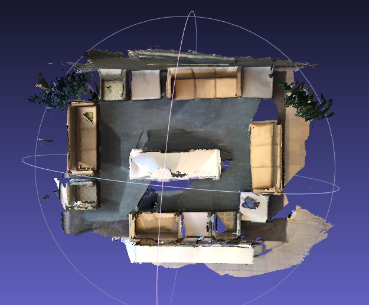
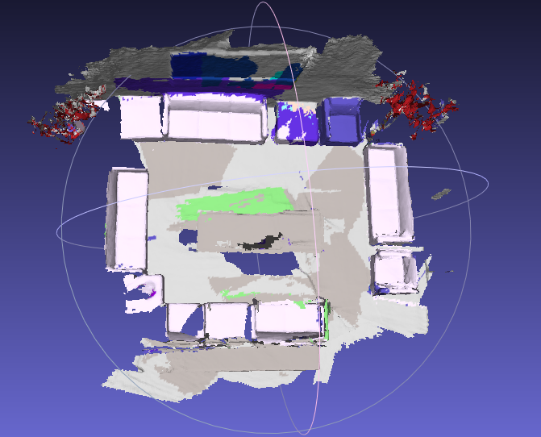

# BundleFusion_Ubuntu_Semantic

```
@article{dai2017bundlefusion,
  title={BundleFusion: Real-time Globally Consistent 3D Reconstruction using On-the-fly Surface Re-integration},
  author={Dai, Angela and Nie{\ss}ner, Matthias and Zoll{\"o}fer, Michael and Izadi, Shahram and Theobalt, Christian},
  journal={ACM Transactions on Graphics 2017 (TOG)},
  year={2017}
}
```

## Installation

This code is tested under ubuntu16.04/GCC7/CUDA10.1 (GPU: RTX2060).

Requirements:

* CMake
* Eigen 3.1.0
* NVIDIA CUDA 9.0/10.+
* OpenCV

Optional:

* Pangolin

```
mkdir build && cd build
cmake -DVISUALIZATION=ON ..
make -j8
```

We use -DVISUALIZATION=OFF/ON to switch visualization plug.

## Usage

* Download datasets from BundleFusion project mainpage [http://graphics.stanford.edu/projects/bundlefusion/](http://graphics.stanford.edu/projects/bundlefusion/) and unzip it.
* Run Commands:

```
cd build
./bundle_fusion_example ../zParametersDefault.txt ../zParametersBundlingDefault.txt /PATH/TO/dataset/office2
```

A pangolin window will show up and get real time reconstruction  result.

* Save Mesh:

we provide save mesh button at pangoln GUI, you need to specify the save path at zParametersDefault.txt for item "s_generateMeshDir"


## Result

We provide a reconstruction result of ScanNet dataset.
<center class="half">
    
    
</center>

